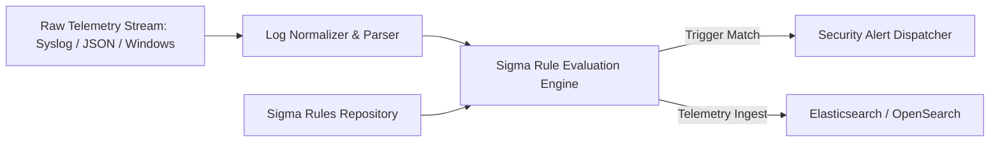

# SOC & SIEM Detection Pipeline Lab
[](LICENSE)
[](#)
[](#)

Geliştirici: **Toprak Ahmet Aydoğmuş**

Bu laboratuvar; telemetri alımı (log ingestion), olay normalizasyonu ve Sigma kurallarını gerçek zamanlı değerlendirip MITRE ATT&CK etiketleri ile güvenlik alarmları üreten tam teşekküllü bir Tespit Mühendisliği (Detection Engineering) boru hattıdır.

## Sistem Mimarisi


## Özellikler
- **Python Tabanlı Sigma Kural Motoru (`engine/sigma_evaluator.py`):** YAML Sigma kurallarını okuyup telemetri kayıtlarına regex/contains sorguları uygular.
- **Otomatik Test Paketi (`tests/test_detection_engine.py`):** Brute force, LOLBAS komut yürütme ve yetki yükseltme kurallarının doğrulanması.
- **Wazuh / OpenSearch Entegrasyonu:** `docker-compose.yml` ile tek komutla ayağa kaldırılabilen merkezi SIEM yığını.

## Hızlı Başlangıç & Test
```bash
# 1. Kural motorunu ve telemetri analiz testlerini çalıştırın
python3 -m unittest discover tests/

# 2. Sigma motorunu bağımsız telemetri akışı ile çalıştırın
python3 engine/sigma_evaluator.py
```

## Lisans
MIT License - Toprak Ahmet Aydoğmuş
